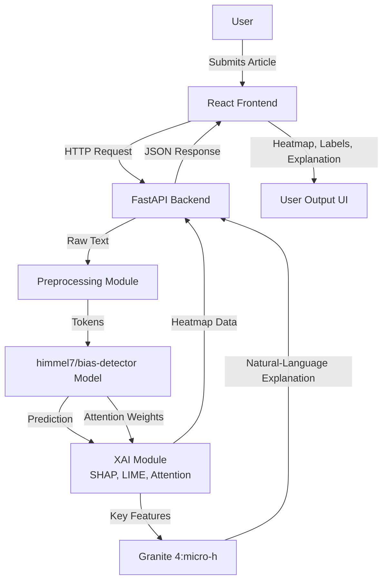
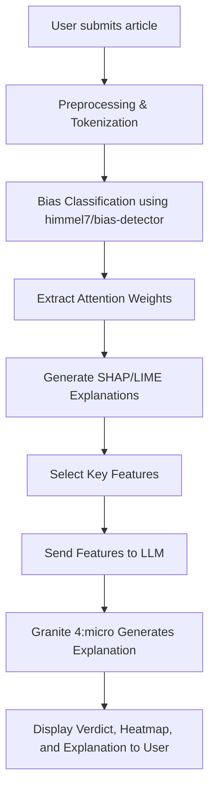

# SmartX: Media Bias Analysis System

**Department of Computer Science and Engineering (Data Science)**  
**Acharya Institute of Technology, VTU**  
**2024–2025**

## Abstract
Media bias, though subtle, has tremendous influence on society, often escaping detection by automated or manual means. This project presents a system for bias detection in English news articles, leveraging a fine-tuned transformer model trained on a curated dataset and enhanced with attention visualization, explainable AI (XAI) techniques (SHAP, LIME), and fast, natural language explanations via Granite 4:micro (a Mamba-Transformer hybrid LLM). Results are provided via a web interface for transparency and interpretability.

## Key Features
*   **Bias Detection**: Uses the `himel7/bias-detector` (Pre-trained RoBERTa) model to classify text.
*   **Explainable AI (XAI)**:
    *   **SHAP**: Visualizes feature contribution.
    *   **LIME**: Identifies local trigger words.
    *   **Attention**: Visualizes model focus.
*   **AI Narrative**: Uses **Granite 4:micro-h** (Hybrid Mamba-Transformer) for fast, natural language explanations.
*   **Interactive UI**: React-based frontend for real-time analysis.

## System Architecture

### Overall Architecture


### Processing Flow


## Methodology
1.  **Analyze Current Scenario**: Identified limitations in existing models.
2.  **Select Model**: Chosen `himel7/bias-detector` (RoBERTa-based) for its performance.
3.  **Implement XAI**: Integrated SHAP, LIME, and Attention mechanisms.
4.  **Hybrid LLM**: Selected **Granite 4:micro-h** (Mamba-Transformer) for 70% faster inference compared to standard Transformers.

## Performance Metrics
*   **Accuracy**: 0.830
*   **F1 Score**: 0.806
*   **Precision**: 0.824
*   **Recall**: 0.782
*   **Model Size**: ~480MB
*   **Max Input Length**: 512 tokens

## Prerequisites
*   **Python 3.10+**
*   **Node.js & npm**
*   **Ollama**: Installed and running.

## Installation & Usage

### Automated Setup
```bash
chmod +x start_project.sh
./start_project.sh
```

### Manual Setup
1.  **Backend**:
    ```bash
    cd backend
    python3 -m venv venv
    source venv/bin/activate
    pip install -r requirements.txt
    ollama pull granite4:micro-h
    uvicorn main:app --reload --port 8000
    ```
2.  **Frontend**:
    ```bash
    cd react_frontend
    npm install
    npm run dev
    ```

## References
1.  Hamborg et al., 2019 - *Automated Identification of Media Bias in News Articles*
2.  Spinde et al., 2021 - *Media Bias Detection Using Deep Learning*
3.  Ribeiro et al., 2016 - *Why Should I Trust You? (LIME)*
4.  Lundberg & Lee, 2017 - *A Unified Approach to Interpreting Model Predictions (SHAP)*
5.  Vaswani et al., 2017 - *Attention Is All You Need*
6.  Devlin et al., 2019 - *BERT: Pre-training of Deep Bidirectional Transformers*
7.  Gu & Dao, 2023 - *Mamba: Linear-Time Sequence Modeling*
8.  Lieber et al., 2024 - *Jamba: A Hybrid Transformer–Mamba LLM*
