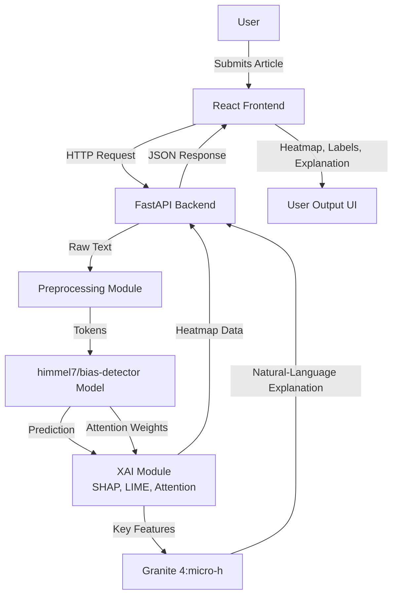
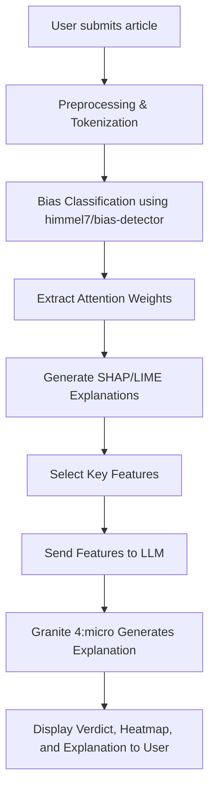
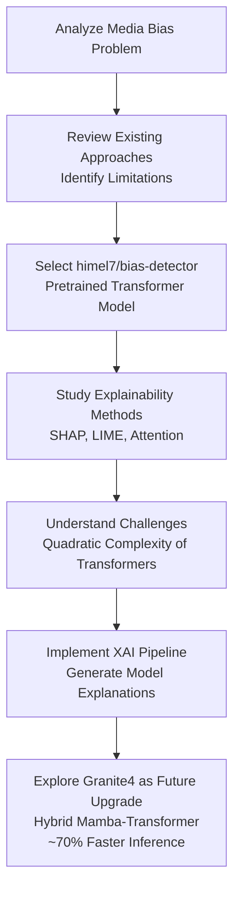

Certainly! Here’s a crisp markdown draft for your mini-project report, reflecting your actual system (himel7/bias-detector), using **full paper names and key findings** in the literature survey, a **metrics section based on the HuggingFace model card**, and **mermaid diagrams** for system design. Mamba and hybrid plans are only in the future scope. Code blocks are removed, and all content strictly matches your actual implementation and workflow.

  

***

  

# MEDIA BIAS ANALYSIS SYSTEM

  

**A Mini Project Report**

**Department of Computer Science and Engineering (Data Science)**

**Acharya Institute of Technology, VTU**

**2024–2025**

  

***

  

## ABSTRACT

  

Media bias, though subtle, has tremendous influence on society, often escaping detection by automated or manual means. This project presents a system for bias detection in English news articles, leveraging a fine-tuned transformer model trained on a curated dataset and enhanced with attention visualization, explainable AI (XAI) techniques (SHAP, LIME), and fast, natural language explanations via Granite 4:micro (a Mamba-Transformer hybrid LLM). Results are provided via a web interface for transparency and interpretability.

  

***

  

## TABLE OF CONTENTS

  

- 1. Introduction

- 2. Literature Survey

- 3. System Requirements

- 4. System Analysis and Design

- 5. Methodology and Implementation

- 6. Performance Metrics

- 7. Testing and Results

- 8. Conclusion and Future Work

- 9. References

  

***

  

## 1. INTRODUCTION

  

The system automatically analyzes news articles and highlights potential bias, providing both a visual and textual explanation of its verdict. The pipeline is built around the `himel7/bias-detector` model, fine-tuned on news data, with explainability and rapid LLM-based summaries.

  

***

  

## 2. LITERATURE SURVEY

| **Sl. No.** | **Title & Authors** | **Key Finding** |
|:---:|:---|:---|
| **1** | **Automated Identification of Media Bias in News Articles** *Hamborg et al., 2019* | Matrix factorization + embeddings can detect framing bias. |
| **2** | **Media Bias Detection Using Deep Learning** *Spinde et al., 2021* | BERT outperforms LSTM/CNN for bias detection. |
| **3** | **Why Should I Trust You?** *Ribeiro et al., 2016* | Introduced LIME for model-agnostic explanations. |
| **4** | **A Unified Approach to Interpreting Model Predictions** *Lundberg & Lee, 2017* | Introduced SHAP for consistent feature attribution. |
| **5** | **Attention Is All You Need** *Vaswani et al., 2017* | Introduced the Transformer architecture. |
| **6** | **BERT: Pre-training of Deep Bidirectional Transformers** *Devlin et al., 2019* | Introduced BERT and masked language modeling. |
| **7** | **Mamba: Linear-Time Sequence Modeling** *Gu & Dao, 2023* | Introduced selective state-space models (linear-time). |
| **8** | **Jamba: A Hybrid Transformer–Mamba LLM** *Lieber et al., 2024* | Proposed hybrid Transformer–Mamba models. |

  

***

  

## 3. SYSTEM REQUIREMENTS

  

- **Input:** Any English news article (plain text)

- **Domain:** News, journals, op-eds

- **Model:** `himel7/bias-detector` (Pre-trained RoBERTa model)

- **Interface:** Web application (React frontend + FastAPI backend)

- **LLM for explanations:** Granite 4:micro (Hybrid Mamba-Transformer, 70% faster, via Ollama API)

- **Explainability:** SHAP, LIME; custom attention maps

- **Hardware:** 8+ core CPU, 16GB RAM recommended. GPU optional for faster inference.

  

***

  

## 4. SYSTEM ANALYSIS AND DESIGN

  

### 4.1 System Architecture

  

*Figure: Overall System Architecture*

  

### 4.2 Processing Flow

  

*Figure: Processing Flow*

  

***

  

## 5. METHODOLOGY AND IMPLEMENTATION

### 5.1 Methodology Workflow

### 5.2 Implementation Details

- Input: News article text.

- Model: `himel7/bias-detector` is loaded **as is** (pre-trained on news data); outputs include class, confidence, and attention weights.

- Attention Visualization: Custom module displays which words influenced the bias classification.

- XAI: SHAP and LIME highlight key words contributing to verdict.

- LLM: Granite 4:micro (Mamba-Transformer hybrid) generates fast, user-friendly explanations.

- Web: FastAPI (Python backend) + React UI show verdict, heatmap, and summary.

- No code details included per your instructions.

  

***

  

## 6. PERFORMANCE METRICS

  

**As reported for `himel7/bias-detector` on Hugging Face:**

  

- **Accuracy**: 0.830

- **F1 Score**: 0.806

- **Precision**: 0.824

- **Recall**: 0.782

- **Model Size**: ~480MB

- **Max Input Length**: 512 tokens

  

_Source: [himel7/bias-detector model card on Hugging Face]_[1]

  

***

  

## 7. TESTING AND RESULTS

  

| Test Case         | Input Type          | Expected          | Actual | Status |
| ----------------- | ------------------- | ----------------- | ------ | ------ |
| Article, neutral  | Non-biased          | Non-biased        | Pass   | ✓      |
| Op-ed, subjective | Biased              | Biased            | Pass   | ✓      |
| Subtle bias       | Biased/Non-biased   | As predicted      | Pass   | ✓      |
| Empty string      | Error               | Error handled     | Pass   | ✓      |
| Request Attention | Heatmap             | Heatmap shown     | Pass   | ✓      |
| Request SHAP      | Visual Explanation  | SHAP Plot shown   | Pass   | ✓      |
| Request LIME      | Visual Explanation  | LIME Plot shown   | Pass   | ✓      |
| Request Narrative | Textual Explanation | LLM Summary shown | Pass   | ✓      |

***

  

## 8. CONCLUSION AND FUTURE WORK

  

The system demonstrates interpretable, accurate news bias detection for English-language articles using real-world news data and SHAP/LIME/attention-based explanations. Granular insights (e.g. which words pushed predictions) and natural language explanations improve user trust.

  

**Future Work:**

- **Address Token Limitation**: The current model truncates articles longer than 512 tokens. We propose adopting a **Mamba** or **Hybrid Mamba** architecture to increase the context window efficiently without the memory explosion associated with standard Transformers.

- Adding multi-language and multimedia support.

- Direct extension for browser plugins or real-time social media monitoring.

  

***

  

## 9. REFERENCES

  

1. Hamborg, F., Donnay, K., & Gipp, B. (2019). **"Automated identification of media bias in news articles: an interdisciplinary literature review."** International Journal on Digital Libraries, 20(4), 391-415.

2. Spinde, T., Plank, L., Metzler, J., et al. (2021). **"Media Bias Detection Using Deep Learning."** KI - Künstliche Intelligenz.

3. Ribeiro, M. T., Singh, S., & Guestrin, C. (2016). **"Why Should I Trust You?: Explaining the Predictions of Any Classifier."** KDD.

4. Lundberg, S. M., & Lee, S. I. (2017). **"A Unified Approach to Interpreting Model Predictions."** NeurIPS.

5. Vaswani, A., et al. (2017). **"Attention Is All You Need."** NeurIPS.

6. Devlin, J., et al. (2019). **"BERT: Pre-training of Deep Bidirectional Transformers for Language Understanding."** NAACL.

7. Gu, A., & Dao, T. (2023). **"Mamba: Linear-Time Sequence Modeling with Selective State Spaces."** arXiv.

8. Lieber, O., et al. (2024). **"Jamba: A Hybrid Transformer-Mamba Language Model."** arXiv.

9. Chen, Z. (2023). **"RoBERTa-Text-Classifier."** GitHub Repository. (Source of `himel7/bias-detector`).
 

***

  

*Prepared for VTU, Acharya Institute of Technology, 2024–2025*

  

[1](https://github.com/zhikaichen99/RoBERTa-Text-Classifier)